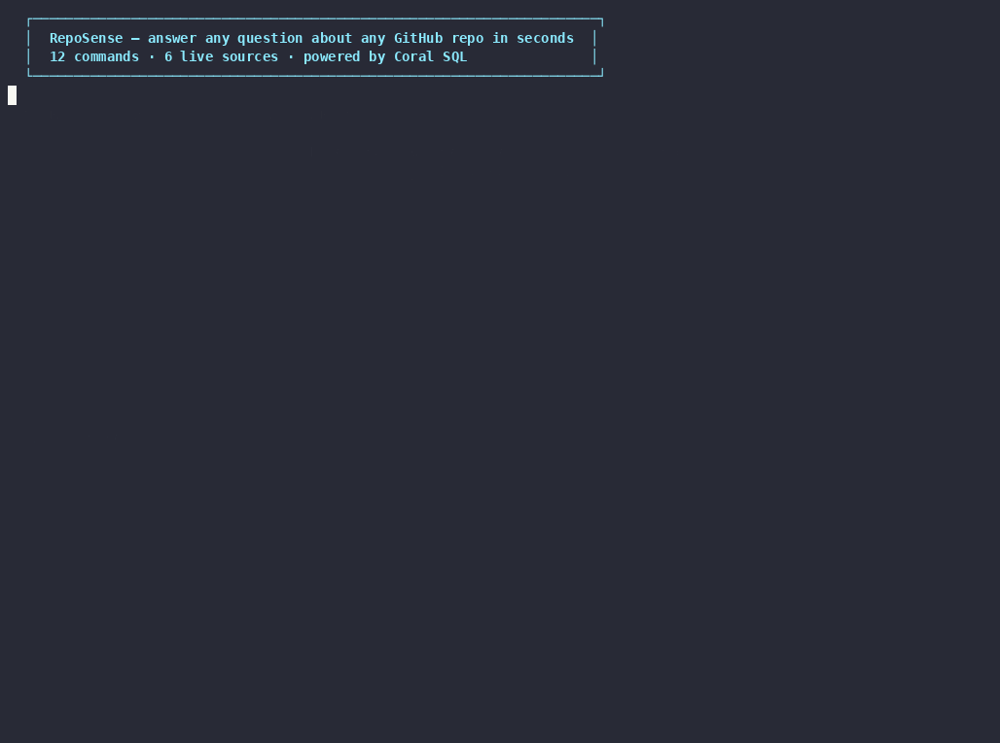

# RepoSense

**GitHub intelligence for any repo — 12 commands, 6 live data sources, one SQL engine.**

RepoSense is a terminal CLI that answers real questions about a GitHub repository in seconds. It uses [Coral](https://withcoral.com) to query GitHub, Hacker News, and the OSV vulnerability database as SQL tables — no ETL, no data warehouse. Every result is live, with a 5-minute disk cache (matching Coral's own HTTP cache window) that makes repeated queries instant.

```
reposense --repo django/django triage
reposense --repo vercel/next.js cve-scan
reposense --repo withcoral/coral hn-buzz
```

Or drop into interactive mode and ask in plain English:

```
reposense --repo facebook/react
> which contributor should I thank this week?
> are there any open security issues?
> what shipped in the last two weeks?
```



---

## What it does

| Command | Question answered | Sources |
|---|---|---|
| `triage` | Which issues have been open longest with no attention? | GitHub |
| `stale-prs` | Which non-draft PRs have been waiting more than 7 days? | GitHub |
| `release-notes` | What merged in the last 14 days? | GitHub |
| `contributors` | Who is most active right now? | GitHub |
| `hn-buzz` | What is Hacker News saying about this project? | GitHub + HN |
| `cve-scan` | Are there open security issues? Known CVEs in dependencies? | GitHub + OSV |
| `duplicates` | Which open issues might be duplicates of each other? | GitHub |
| `health` | What is the overall repo health score right now? | GitHub (4 signals) |
| `pulse` | What is HN discussing alongside the top open GitHub issues? ★ | GitHub + HN (cross-source JOIN) |
| `so-buzz` | What are developers struggling with on Stack Overflow? ★ | Stack Overflow |
| `dev-buzz` | What are developers writing about this tech on Dev.to? ★ | Dev.to |
| `scorecard` | What is this repo's OpenSSF security posture? ★★ | OpenSSF Scorecard |

★ `pulse` uses a single cross-source SQL JOIN across two Coral sources. `so-buzz`, `dev-buzz`, and `scorecard` require their respective optional sources (see Quick Start).
★★ `scorecard` is zero-config — no API key needed; queries the OpenSSF Scorecard API for any public GitHub repo.

Any question not covered by those 12 commands → type it in plain English and the built-in AI agent (Claude or GPT-4o) writes the SQL and runs it for you.

---

## Quick Start

```bash
git clone https://github.com/athul-2003/reposense
cd reposense
bash setup.sh
```

`setup.sh` installs Coral, connects all 6 data sources, and installs the `reposense` command — one script, no manual steps. The only prompt is your GitHub Personal Access Token (needed once).

**GitHub PAT scopes needed:** `repo` (read) + `read:org` + `security_events` (for Dependabot alerts)
Get one at: GitHub → Settings → Developer settings → Personal access tokens

Once setup completes:

```bash
reposense --repo withcoral/coral triage
reposense --repo django/django health
reposense --repo expressjs/express scorecard
reposense                                    # interactive mode — prompts for repo
```

### MCP server mode (Claude Desktop / Cursor / Continue)

RepoSense can also run as an MCP server, letting any MCP-compatible AI assistant call its commands directly.

**Install in one command (Claude Code CLI):**

```bash
claude mcp add reposense -- reposense --mcp
```

**Or add manually to your Claude config:**

```json
{
  "mcpServers": {
    "reposense": {
      "command": "reposense",
      "args": ["--mcp"]
    }
  }
}
```

Then ask Claude: *"What are the stale PRs for django/django?"* — it will call RepoSense's Coral SQL engine and return live results.

**MCP tools exposed:**
- `run_command` — runs any of the 12 built-in commands against any repo
- `coral_sql` — executes arbitrary SQL across all installed Coral sources
- `list_sources` — discovers installed sources and column schemas

### Dev mode (run from source)

```bash
uv sync
uv run python reposense.py --repo withcoral/coral triage
```

---

## Updating

If you installed via `uv tool install .` and want the latest version after a new release:

```bash
cd reposense          # wherever you cloned the repo
git pull origin main  # pull the latest changes
uv tool install . --reinstall  # reinstall with updated code
```

That's it — `reposense` is immediately updated globally. No need to re-run `coral source add` or touch `.env`.

If you installed from a fork or a specific commit, point `uv tool install` at the new source instead:

```bash
uv tool install git+https://github.com/athul-2003/reposense.git --reinstall
```

---

## Commands — Full Reference

Every command follows this pattern:

```
reposense --repo <owner>/<repo> <command>
```

### `triage`

Shows the 15 oldest open issues and PRs with no attention — sorted by creation date ascending. Use this to find what has been ignored the longest.

```bash
reposense --repo withcoral/coral triage
```

Output: Table with `#`, `Title`, `Author`, `Type` (issue/PR). Color-coded: green = issue, yellow = PR.

---

### `stale-prs`

Shows non-draft PRs that have been open for more than 7 days. These are ready for review but haven't been merged or closed.

```bash
reposense --repo vercel/next.js stale-prs
```

Output: Table with `#`, `Title`, `Author`, `Type`. Up to 30 results.

---

### `release-notes`

Shows all PRs merged in the last 14 days. Use this as the input for writing a CHANGELOG or release notes.

```bash
reposense --repo django/django release-notes
```

Output: Table of merged PRs. Footer suggests pasting into Claude Code for formatted Markdown release notes.

---

### `contributors`

Shows the top 10 contributors by activity in the last 30 days — issues and PRs combined.

```bash
reposense --repo facebook/react contributors
```

Output: Ranked table with `Author` and `Items` count. Top contributor highlighted in bold green.

---

### `hn-buzz`

Shows the top 10 Hacker News posts about the project or its technology space, sorted by upvotes.

```bash
reposense --repo withcoral/coral hn-buzz
```

Output: Table with `Title`, `Upvotes`, `Comments`, `Author`, `Date`. Posts with 100+ upvotes highlighted in green.

**Smart auto-detect:** The HN search term is chosen automatically in this priority order:
1. `HN_QUERY` env var (set in `.env`) — always takes precedence
2. First topic tag from the repo (e.g. `django/django` → `python`, `expressjs/express` → `javascript`)
3. Repo name as fallback

For repos with ambiguous names (e.g. `coral` returns coral reef posts), set `HN_QUERY` in `.env`:

```bash
HN_QUERY=MCP server   # searches HN for "MCP server" instead of "coral"
```

---

### `cve-scan`

Runs three queries in sequence:

1. **Query A — Dependabot alerts:** Real confirmed CVEs in the repo's actual dependencies, pulled from GitHub's Dependabot API. Requires Dependabot to be enabled on the repo and a PAT with `security_events` scope. Shows a dim info note if not available — does not block the next sections.
2. **Query B — GitHub keyword search:** Searches open issues mentioning "security vulnerability" in this repo (keyword match — may include tangential results).
3. **Query C — OSV CVE lookup:** Queries the [OSV vulnerability database](https://osv.dev) for known CVEs in a specific dependency package and version.

```bash
reposense --repo withcoral/coral cve-scan
```

Output:
- Dependabot alerts table with **CRITICAL** / **HIGH** / **MEDIUM** / **LOW** severity badges, or an info note if Dependabot is not enabled
- Security-related issues table from GitHub keyword search (with disclaimer)
- CVE vulnerabilities table from OSV with severity parsed from CVSS vectors

**Auto-detection:** RepoSense fetches the repo's manifest file (`requirements.txt`, `package.json`, `Cargo.toml`, `go.mod`, `Gemfile`, `pyproject.toml`) and detects the package automatically — no configuration needed for public repos.

Override if you want to scan a specific package:

```bash
# .env — only needed to override auto-detection
PACKAGE_NAME=django
PACKAGE_ECOSYSTEM=PyPI        # PyPI, npm, Go, Maven, RubyGems, NuGet, crates.io
PACKAGE_VERSION=4.2.0
```

---

### `duplicates`

Detects potential duplicate issues using a CROSS JOIN on the 50 most recently opened issues. Python post-processing filters results by title similarity — only pairs with 2+ shared significant keywords are shown, avoiding false positives.

```bash
reposense --repo withcoral/coral duplicates
```

Output: Table showing pairs of issues with similar titles, including the matched keywords and color coding by match strength (bold = 4+ words shared, yellow = 3+, dim = 2+). Scans up to 1225 pairs across the 50 most recent open issues.

**Note:** This is the slowest command (~15–85s depending on repo size) due to the CROSS JOIN. Bounded to the 50 most recent open issues regardless of total repo size. See [engineering-decisions.md](docs/engineering-decisions.md) ED-004 and ED-011.

---

### `pulse` ★

Runs a cross-source SQL JOIN between HN trending posts and the top open GitHub issues in a single SQL statement. Shows what the tech community is discussing alongside what your project still has open.

```bash
reposense --repo django/django pulse
# → auto-detects 'python' topic → shows top Python HN posts × top open django issues
```

Output: Table showing HN upvote score | HN post title | GitHub issue number | GitHub issue title | Author. Each row is one HN post × one GitHub issue from the CROSS JOIN.

The technology for HN search is auto-detected from `github.repo_topics` — the same mechanism as `hn-buzz`. Override with `HN_QUERY=your-term` in `.env`.

---

### `so-buzz` ★

Surfaces the top Stack Overflow questions for the technology used in a GitHub repo, sorted by vote score. Requires the Stack Overflow community source (see Quick Start Step 3).

```bash
reposense --repo django/django so-buzz      # → top python SO questions (7000+ upvotes)
reposense --repo expressjs/express so-buzz  # → top javascript SO questions
```

Output: Table showing question title | vote score | answer count | view count | answered? | posted date. Highlighted green for high-score questions (>500 votes), yellow for mid-range (>100).

Technology is auto-detected the same way as `hn-buzz` and `pulse`.

---

### `dev-buzz` ★

Surfaces trending Dev.to articles for the technology used in a GitHub repo, sorted by newest first. Requires the Dev.to community source (see Quick Start Step 3).

```bash
reposense --repo django/django dev-buzz      # → python articles on Dev.to
reposense --repo expressjs/express dev-buzz  # → javascript articles
reposense --repo rust-lang/rust dev-buzz     # → rust articles
```

Output: Table showing article title | ♥ reactions | 💬 comments | author | published date. Highlighted by reaction count — green for viral (>100 reactions), yellow for engaged (>20 reactions).

Technology is auto-detected the same way as `hn-buzz`, `so-buzz`, and `pulse`.

---

### `scorecard` ★★

Shows the full OpenSSF Scorecard security posture for any public GitHub repo — up to 18 security checks, each scored 0–10. Zero auth, zero config. Requires the scorecard community source (see Quick Start Step 3).

```bash
reposense --repo expressjs/express scorecard   # → 18 checks, color-coded
reposense --repo django/django scorecard       # → Django security posture
reposense --repo rust-lang/rust scorecard      # → Rust project health
```

Output: Table with `Check`, `Score` (color-coded: green ≥8, yellow 5–7, red <5, dim = N/A), `Reason`. Footer shows passing/total summary. Checks include Code-Review, Branch-Protection, Token-Permissions, Pinned-Dependencies, SAST, Signed-Releases, Fuzzing, and more.

Score -1 means the check is not applicable for that repo (e.g. no releases to sign).

---

### `health`

Calculates a repo health score (0–100) from 4 live signals run concurrently:

| Signal | Effect on score |
|---|---|
| Stale issues (open > 14 days, < 2 comments) | −3 per issue, max −40 |
| Stale PRs (open > 7 days, not draft) | −2 per PR, max −30 |
| Merged PRs this week | +2 per PR, max +20 |
| Issues closed this week | +1 per issue, max +10 |

Score ranges: **> 70** = green (Healthy), **40–70** = yellow (Needs attention), **< 40** = red (Critical).

```bash
reposense --repo django/django health
```

Output: A live progress bar showing the score with color coding and a one-line summary.

The health score also runs automatically on the splash screen when you enter interactive mode.

---

## Interactive Mode

Running `reposense` with no command drops into an interactive session. The repo health score is calculated and displayed on entry.

```bash
reposense --repo withcoral/coral
# Shows splash screen with health score
# Then shows command menu

> triage          # run a command
> stale-prs       # run another command
> health          # see health score again
> quit            # exit
```

If no `--repo` flag is given, RepoSense prompts for one:

```bash
reposense
# 🔍 Which repo do you want to analyse?
# > django/django
```

---

## Agent Mode — Free-form Questions

Ask any question in plain English — directly from the command line or in interactive mode. The agent has one tool — `coral_query(sql)` — and uses it to answer your question.

**Direct (scriptable):**
```bash
reposense --repo withcoral/coral ask "how many issues were opened vs closed this month?"
reposense --repo django/django ask "who are the top contributors this week?"
reposense --repo vercel/next.js ask "are there any open issues mentioning performance?"
```

**Interactive mode** (type after entering the session):
```
> which contributor should I thank this week?
> are there any open issues labelled "help wanted"?
> what did we ship in the last two weeks?
> who has the most unmerged PRs right now?
```

The agent:
1. Writes the SQL query for your question
2. Displays the SQL it will run (so you can see exactly what it's doing)
3. Runs it against Coral
4. Reads the results and answers in plain English

**Requires one of:**
- `ANTHROPIC_API_KEY` — uses Claude Sonnet (recommended)
- `GROQ_API_KEY` — uses Llama 3.3 via Groq (**free tier**, fast)
- `OPENAI_API_KEY` — uses GPT-4o

Priority order: Claude > Groq > GPT-4o. If none is set, all 12 direct commands still work — only free-form questions are unavailable.

```bash
# Set in .env — only one needed
ANTHROPIC_API_KEY=sk-ant-...       # https://console.anthropic.com
GROQ_API_KEY=gsk_...               # https://console.groq.com (free)
OPENAI_API_KEY=sk-...              # https://platform.openai.com
```

**Agent guardrails:**
- Maximum 10 tool calls per question (prevents runaway loops)
- 90-second timeout per query
- System prompt instructs the agent to treat data from GitHub (issue titles, PR bodies) as untrusted — not as instructions
- Grounding rules: agent must answer **only** from `coral_query` results — never from training knowledge about a specific repo. If data is unavailable, it says so rather than guessing

---

## Configuration

Copy `.env.example` to `.env` and set what you need. All values are optional — the defaults work for the demo repo (`withcoral/coral`).

```bash
cp .env.example .env
```

| Variable | Default | Purpose |
|---|---|---|
| `GITHUB_OWNER` | `withcoral` | Default owner when no `--repo` flag |
| `GITHUB_REPO` | `coral` | Default repo when no `--repo` flag |
| `HN_QUERY` | *(repo name)* | Hacker News search term for `hn-buzz` |
| `PACKAGE_NAME` | `requests` | Package to scan in `cve-scan` |
| `PACKAGE_ECOSYSTEM` | `PyPI` | Package ecosystem (`PyPI`, `npm`, `Go`, etc.) |
| `PACKAGE_VERSION` | `2.25.0` | Package version to check CVEs for |
| `ANTHROPIC_API_KEY` | *(unset)* | Enables Claude Sonnet for agent mode |
| `GROQ_API_KEY` | *(unset)* | Enables Llama 3.3 via Groq for agent mode (free) |
| `OPENAI_API_KEY` | *(unset)* | Enables GPT-4o for agent mode |
| `REPOSENSE_MODEL` | *(provider default)* | Override model name (e.g. `claude-opus-4-7`) |

**.env permissions:** The `.env` file should be readable only by you. RepoSense sets `600` permissions automatically, but verify with:

```bash
chmod 600 .env
```

---

## How It Works

```
reposense.py  ──► coral sql -- "<SQL>"  ──► GitHub API
                                        ──► Hacker News API
                                        ──► OSV API
                    ▲
agent/claude_agent.py (for free-form questions)
```

1. You run a command or type a question.
2. RepoSense reads the corresponding `.sql` file from `queries/`.
3. Runtime tokens (`{owner}`, `{repo}`, `{30_days_ago}`, etc.) are substituted.
4. The SQL is passed to `coral sql -- "<query>"` as a subprocess.
5. Coral executes the query against live APIs and returns an ASCII table.
6. RepoSense parses the table and renders it with Rich.

For free-form questions, step 2–5 happen inside a tool-use loop driven by the LLM.

### Runtime tokens

| Token | Resolves to |
|---|---|
| `{owner}` | GitHub org/username |
| `{repo}` | Repository name |
| `{30_days_ago}` | ISO date 30 days ago |
| `{14_days_ago}` | ISO date 14 days ago |
| `{7_days_ago}` | ISO date 7 days ago |
| `{hn_query}` | HN search term (`HN_QUERY` env or repo name) |
| `{package_name}` | Package to CVE-scan (`PACKAGE_NAME` env) |
| `{package_ecosystem}` | Ecosystem (`PACKAGE_ECOSYSTEM` env) |
| `{package_version}` | Version (`PACKAGE_VERSION` env) |

---

## Data Sources

| Source | Auth | Coral tables used |
|---|---|---|
| GitHub | PAT (read-only) | `github.search_issues()`, `github.issues` |
| Hacker News | none | `hn.search` |
| OSV | none | `osv.query_by_version` |
| Stack Overflow | none | `stackoverflow.questions` |
| Dev.to | none | `devto.articles` |
| OpenSSF Scorecard | none | `scorecard.checks` |

All six sources are queried via Coral SQL — no direct HTTP calls in RepoSense code.

---

## The SQL Patterns

Every command is a `.sql` file in `queries/`. The critical pattern is `github.search_issues()` — a Coral table function that pushes filters to the GitHub Search API server-side.

### Why `search_issues()` and not `github.issues`

The REST-paginated `github.issues` table fetches all pages before applying `LIMIT`. On `django/django` (14 000+ issues), `LIMIT 15` still fetches 14 000 records and times out. `search_issues()` returns only the matching items — one API call, any repo size, under 2 seconds.

### Why `LIMIT` inside a subquery

```sql
SELECT COUNT(*) FROM (
  SELECT 1 FROM github.search_issues(q => '...') LIMIT 50
) sub
```

Without the inner `LIMIT`, `COUNT(*)` paginates all results before returning. The `LIMIT 50` cap stops Coral at ~3–4 API pages. The health score formula saturates well below 50, so accuracy is unchanged.

### Why the CROSS JOIN has a `LIMIT 50` per side

```sql
FROM (SELECT ... LIMIT 50) a
CROSS JOIN (SELECT ... LIMIT 50) b
```

50 × 50 = 2 500 pairs maximum. Without bounds, 14 000 × 14 000 = 196 million pairs — never completes. Covers the 50 most recent issues, which is the most useful window for detecting fresh duplicates.

Full decision log with timing data → [docs/engineering-decisions.md](docs/engineering-decisions.md)

---

## Project Structure

```
reposense/
├── run.sh                  # Entry point (wraps: uv run python reposense.py)
├── reposense.py            # CLI entrypoint, command routing, interactive loop
├── queries/                # SQL files — one per feature
│   ├── triage.sql
│   ├── stale_prs.sql
│   ├── release_notes.sql
│   ├── contributors.sql
│   ├── hn_buzz.sql
│   ├── cve_scan.sql        # Three queries: Dependabot + keyword + OSV (separated by ==QUERY_B==, ==QUERY_C==)
│   ├── duplicates.sql
│   ├── pulse.sql           # Cross-source CROSS JOIN: github.search_issues × hn.search
│   ├── so_buzz.sql         # Stack Overflow top questions (requires SO source)
│   ├── dev_buzz.sql        # Dev.to trending articles (requires devto source)
│   └── scorecard.sql       # OpenSSF Scorecard checks (requires scorecard source)
├── sources/
│   ├── stackoverflow/
│   │   ├── manifest.yaml   # Coral DSL v3 source spec — Stack Exchange API (zero auth)
│   │   └── README.md       # Install instructions + example SQL
│   ├── devto/
│   │   ├── manifest.yaml   # Coral DSL v3 source spec — Dev.to API (zero auth)
│   │   └── README.md
│   └── scorecard/
│       ├── manifest.yaml   # Coral DSL v3 source spec — OpenSSF Scorecard API (zero auth)
│       └── README.md       # Install instructions, score reference, DSL patterns used
├── agent/
│   ├── claude_agent.py     # Agentic loop — Claude or GPT-4o backend
│   ├── coral_runner.py     # run_query(), substitute_tokens(), validate_repo_slug()
│   └── prompts.py          # System prompt with Coral table docs + security guardrails
└── ui/
    ├── splash.py           # Logo, health score bar, concurrent signals
    ├── chat.py             # SQL panel, spinner, error panel
    └── tables.py           # Rich table renderers per command
```

Adding a new command: write a `.sql` file, add one entry to `_COMMAND_MAP`. No other changes needed.

---

## Performance

Tested on two repos of very different sizes:

| Command | withcoral/coral (~650 issues) | django/django (14 000+ issues) |
|---|---|---|
| triage | 1.4s | 1.2s |
| stale-prs | 1.8s | 1.4s |
| contributors | 3.0s | 2.7s |
| hn-buzz | 1.6s | 1.5s |
| cve-scan | 2.3s | 2.2s |
| release-notes | 2.4s | 1.7s |
| duplicates | 15–20s | 25–35s |
| health | 2.5s | 2.2s |
| pulse | 2.4s | 2.4s |
| so-buzz | 1.1s | 0.9s |
| dev-buzz | 1.7s | 1.7s |
| scorecard | 1.0s | 0.9s |

All commands except `duplicates` return in under 5 seconds on any public repo. `duplicates` is slower by design (CROSS JOIN + similarity scan) and completes in under 90 seconds on any public repo tested.

---

## Security

- **Input validation:** `--repo` values are validated against GitHub naming rules before substitution into SQL. Injection attempts (e.g. `"'; DROP TABLE/repo"`) are rejected with a clear error.
- **No shell injection:** `subprocess.run()` uses a list argument and `--` separator — no `shell=True`.
- **Read-only:** Coral is a read-only SQL engine. No write operations are possible.
- **Subprocess timeout:** All queries time out after 90 seconds with a user-facing error.
- **Agent guardrails:** Max 10 LLM turns per question. System prompt instructs the agent to treat GitHub data (issue titles, PR bodies) as untrusted content — not as instructions.
- **Secrets:** API keys loaded from `.env` only (never from command args). `.env` is gitignored and should be `chmod 600`.

---

## Troubleshooting

**`coral: command not found`**
Coral is not installed or not in `PATH`. Run the install command from the Quick Start and restart your terminal.

**`Error: source 'github' not found`**
GitHub source not connected to Coral. Run `coral source add --interactive github` and enter your PAT.

**`Error: Query timed out after 90s`**
The query hit the 90-second safety timeout. This is most common with `duplicates` on very large repos. Try running `reposense --repo <owner>/<repo> triage` instead, which always returns in under 2 seconds.

**`Error:` from Coral on `hn-buzz`**
Usually means the HN source is not installed. Run:
```bash
coral source add --file coral-repo/sources/community/hn/manifest.yaml
```

**Agent mode says "No API key found"**
Add one of these to your `.env` — Groq is free:
```bash
GROQ_API_KEY=gsk_...          # free — https://console.groq.com
ANTHROPIC_API_KEY=sk-ant-...  # https://console.anthropic.com
OPENAI_API_KEY=sk-...         # https://platform.openai.com
```
All 12 direct commands work without any API key.

**`hn-buzz` shows unrelated posts**
RepoSense auto-detects a better search term via the repo's topic tags. If the repo has no topics and the name is ambiguous (e.g. "coral" → coral reef posts), set `HN_QUERY` in `.env` explicitly:
```bash
HN_QUERY=MCP server
```

**`cve-scan` scans the wrong package**
RepoSense auto-detects the first dependency from the repo's manifest file. If you want to scan a specific package, override in `.env`:
```bash
PACKAGE_NAME=express
PACKAGE_ECOSYSTEM=npm
PACKAGE_VERSION=4.17.1
```

---

## Built With

- [Coral](https://withcoral.com) — SQL-over-APIs runtime (GitHub, HN, OSV)
- [Claude](https://claude.ai) / [GPT-4o](https://openai.com) — configurable AI agent backend
- [rich](https://github.com/Textualize/rich) — terminal UI (tables, panels, progress bars, spinners)
- [click](https://click.palletsprojects.com) — CLI framework
- [python-dotenv](https://github.com/theskumar/python-dotenv) — `.env` loading
- [uv](https://github.com/astral-sh/uv) — Python package management

---

*Built for the [Pirates of the Coral-bean Hackathon](https://wemakedevs.org/hackathons/coral) — WeMakeDevs × Coral, May 2026.*
*Full technical write-up → [docs/blog-post.md](docs/blog-post.md)*
